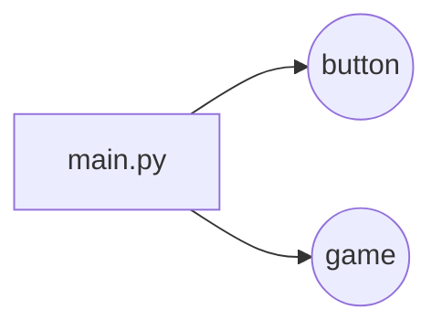

# BASKET GO!

Basket Go ! est un jeu tournant sous la bibliothèque **Pygame**, comme son nom l'indique l'univers de ce jeu vidéo est tourner vers le basketball, comportant **trois catégories :** 
(Solo / 1vs1 'tour par tour' / Niveaux) Dont le but est de s'amusez en se challengeant à **marquez le plus de panier possible** dans un **temps imparti (45sec)**, le jeu étant composée d'une **boutique** et de sa propre **monnaie (Go ticket)** vous la gagnerait à chaque fin de partie selon le score obtenue. 
A vous de Jouez !

